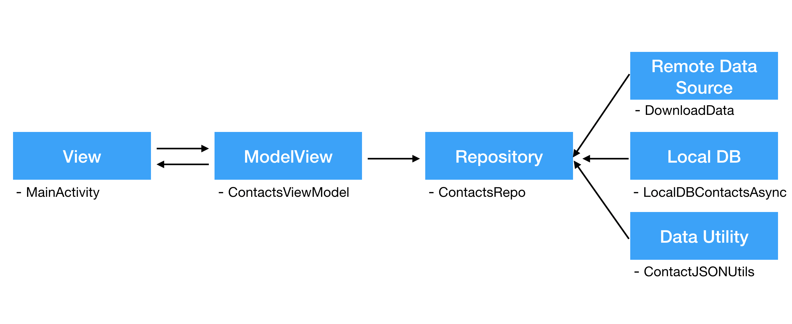
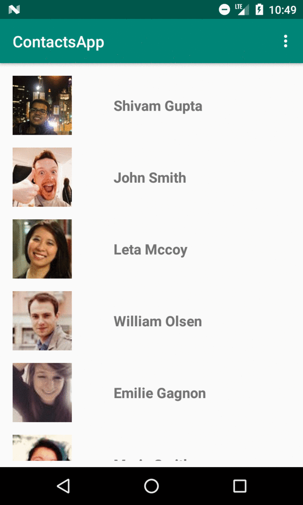

# ContactsApp

The ContactsApp is a demonstration of several aspects of Android development in Kotlin. 
The app follows MVVM architecture and covers aspects such as:
- Fetching API data asynchronously
- Retrieving data from local SQLite database
- Implementing callbacks
- RecyclerView with Adapters
- Parsing JSON data and forming objects asynchronously
- Serializing JSON objects (Parcelable)
- Implementing ViewModel with LiveData Observer

## API Used
The API used to get random user data is called RandomUser [Link](https://randomuser.me/).

## Architecture

## Demo

